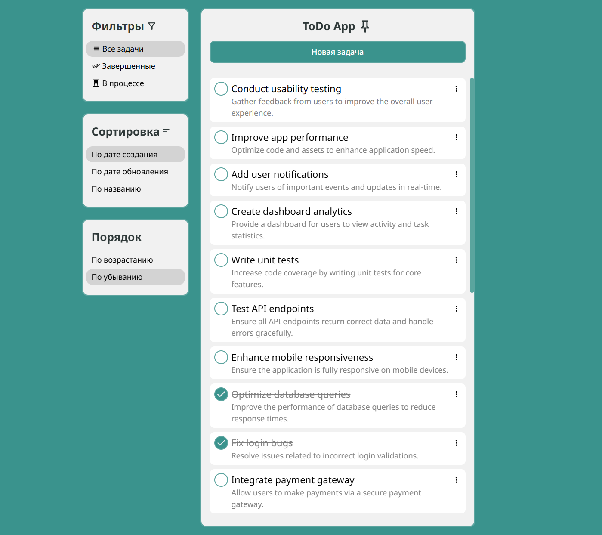
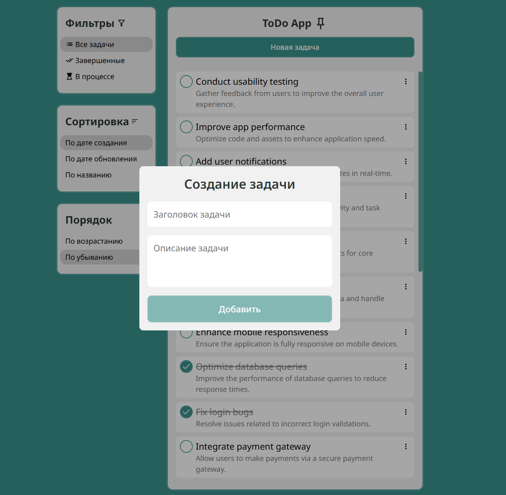
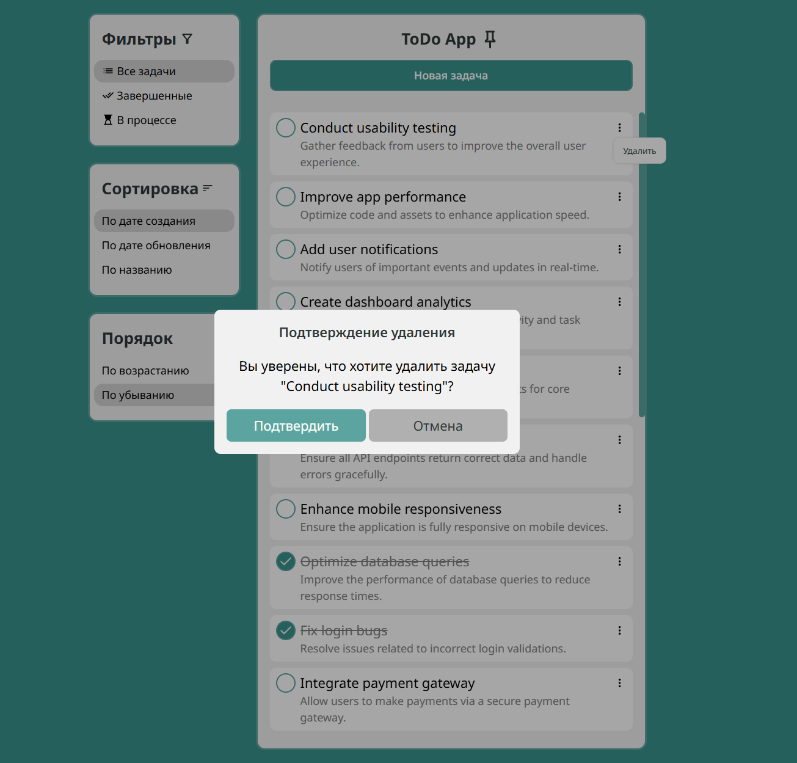
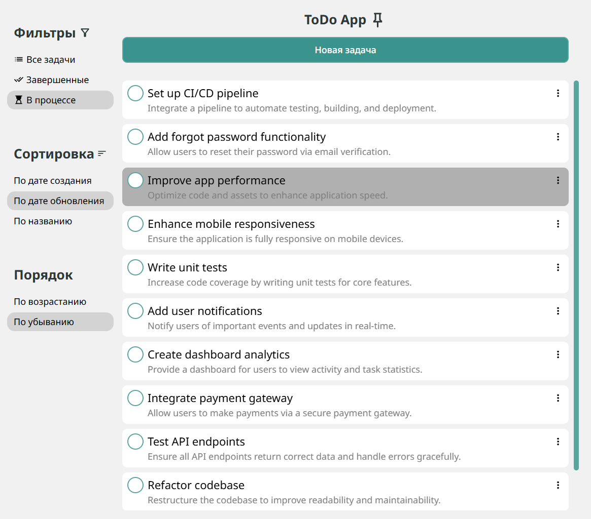
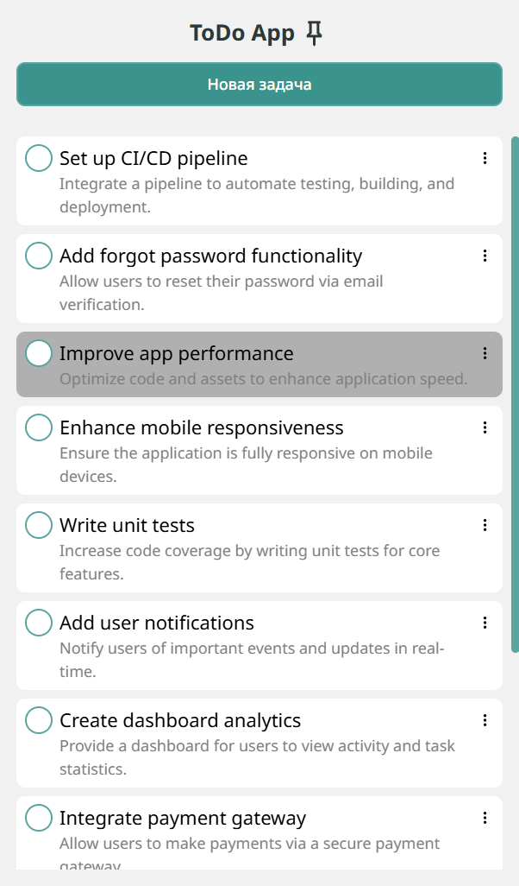

# ToDoApp

Реализованное приложение представляет собой решение тестового задания от Sputnik.

Целью было разработать Todo List, используя предоставленный апи: https://cms.laurence.host/api

Документация по апи: https://cms.laurence.host/documentation/v1.0.0#/Task

## Реализация

В приложении реализован функционал:
- Добавление задачи (с модальным окном для создания)
- Удаление задачи (с модальным окном подтверждения)
- Получение списка всех задач
- Изменение задачи (статус, заголовок, описание)
- Фильтрация задач по (все, выполненные, не выполненные)
- Упорядочивание задач (дата создания, дата обновления, по заголовку)

Используемый стек:
- React
- TypeScript
- MobX
- Styled Components
- Vite

Приложение работает на MockApi, для стабильной работы при нестабильности Api от Sputnik. Но на момент пуша полностью корректно работает и с апи от Sputnik.

Для работы с их апи нужно заменить первую строчку в src/services/TaskService.ts с `import TasksApi from "../api/MockApi";` на `import TasksApi from "../api/TasksApi";`

## Скрины

